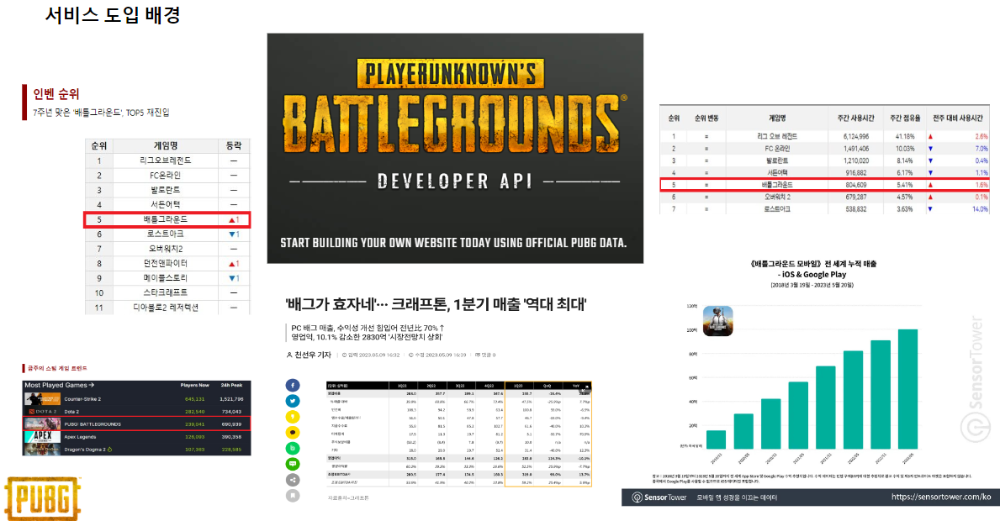
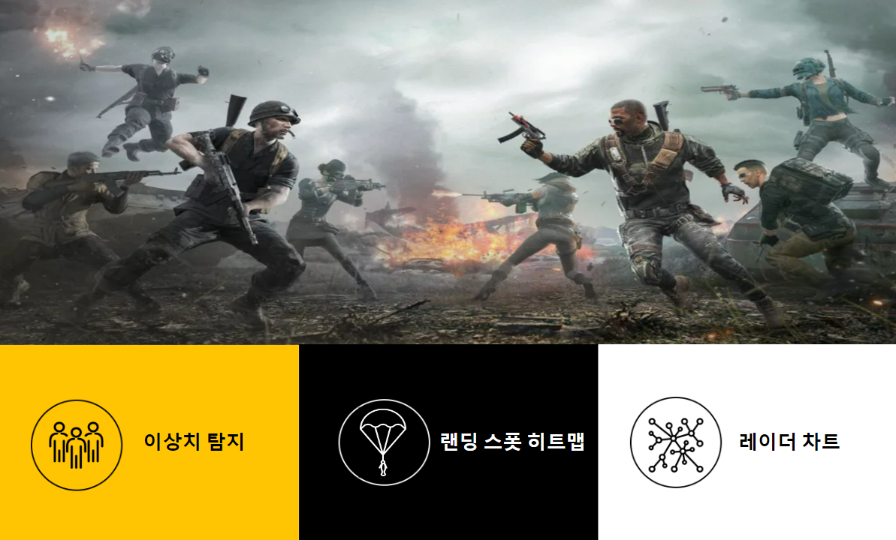
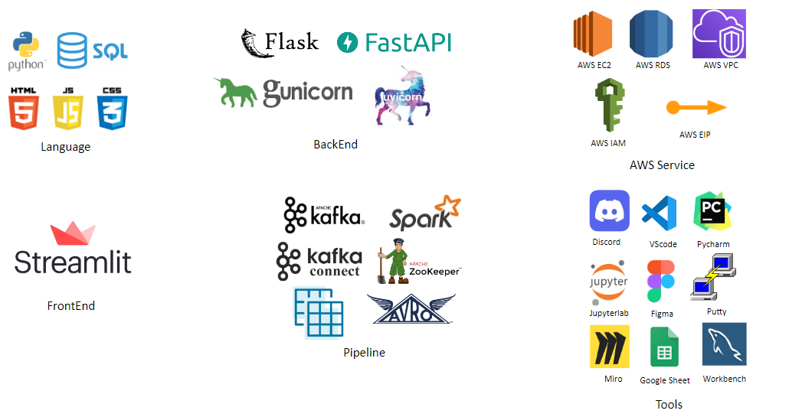
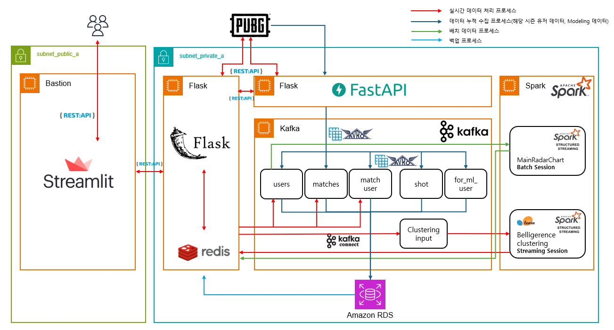
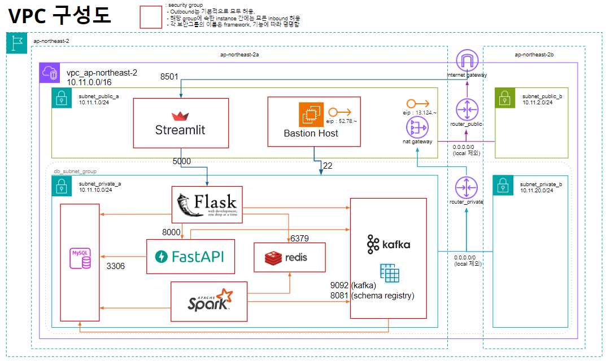

# DE30 Team 3's Final project

### Please read our projectPR.pptx for more details  😉
## 👉 서비스 개요
### 서비스 도입 배경

#### 전 세계적인 시장 선점성
   * 배틀그라운드는 전 세계적으로 높은 인기를 누리고 있으며, 수많은 유저를 보유하고 있습니다. 이는 게임 산업에서 배틀그라운드가 상당한 영향력을 가지고 있음을 의미하며, 이를 통해 프로젝트의 잠재적인 사용자 기반이 매우 넓다는 것을 보여줍니다.
#### API를 통한 풍부한 데이터 접근성
   * 배틀그라운드는 공식 API를 통해 다양한 게임 데이터를 제공하고 있습니다. 이러한 데이터는 플레이어의 경기 기록, 행동 패턴, 게임 환경 등과 같은 다양한 측면을 분석할 수 있는 기회를 제공합니다. 데이터의 다양성과 풍부함은 이 프로젝트가 단순한 전적 검색을 넘어, 심층적인 분석과 유용한 통찰을 제공할 수 있는 기반이 됩니다.
#### 성장 가능성과 시장 수요
   * 배틀그라운드와 관련된 서드파티 서비스들은 이미 많은 유저들에게 필수적인 도구로 자리 잡고 있습니다. 그러나 기존의 서비스들은 아직도 개선의 여지가 있으며, 특히 개인화된 데이터 분석과 맞춤형 피드백을 제공하는 데 있어 더욱 발전할 가능성이 큽니다. 이러한 시장 수요와 성장 가능성은 이 프로젝트의 성공 가능성을 높여주는 중요한 요소입니다.

### 기존 서드파티 웹 사이트와의 차별점

#### 이상치 탐지 및 분석
   * 게임 플레이 중 예상치 못한 특이점이 발생할 경우, 우리의 서비스는 전적 검색을 통해 수치화된 데이터를 제공하여 해당 특이점이 이상치인지 여부를 판단하고 분석할 수 있도록 지원합니다. 이를 통해 플레이어는 게임 내 비정상적인 패턴이나 결과를 보다 정확하게 감지할 수 있습니다. 이로써 플레이어는 불규칙한 성과나 예기치 못한 결과를 이해하고, 이를 개선하거나 반복을 방지하는 데 도움을 받을 수 있습니다.
#### 랜딩 스폿 히트맵 제공
   * 우리는 랜딩 스폿 히트맵을 통해 전투를 선호하는 플레이어와 전투를 지양하는 플레이어들이 자신의 기호에 맞는 전략적 선택을 할 수 있도록 돕습니다. 이를 통해 플레이어는 게임 플레이의 만족도를 크게 향상시킬 수 있습니다.
#### 레이더 차트 기능
   * 우리는 레이더 차트를 통해 전체 유저 또는 특정 구간의 유저들과 자신의 지표를 비교할 수 있는 기능을 제공합니다. 이 기능을 통해 플레이어는 자신의 상대적 위치를 빠르고 정확하게 가늠할 수 있어, 자신의 강점과 약점을 명확하게 파악하고 이를 기반으로 전략을 조정할 수 있습니다.

## 👉 팀원 소개 및 역할 분배
<table>
    <tr>
        <th>김민승 </th>
        <th>김경현</th>
        <th>김민성</th>
        <th>이선경</th>
        <th>이진수</th>
    </tr>
    <tr>
        <td>TA 및 데이터 파이프라인 구축(Kafka), 백엔드 서버(Flask), 아키텍쳐 설계</td>
        <td>서비스 기획, 프론트엔드 서버(Streamlit), 데이터 수집 프로세스 개발(FastAPI) </td>
        <td>데이터 분석, 머신러닝 모델링(에임 이상치 탐색)</td>
        <td>데이터 분석, 머신러닝 모델링(스피드핵 이상치 탐색)</td>
        <td>아키텍쳐 설계,   프론트엔드 서버(Streamlit) 데이터 파이프라인 구축(Spark)</td>
    </tr>
</table>

## 👉 기술 스택 

## 👉 아키텍쳐 및 AWS VPC 구성도 

## 👉 회고록
민승 
* 프로젝트를 진행하면서 처음으로 AWS를 접해볼 수 있었어서 좋았습니다.이번에 과감하게 도전해볼 수 있는 좋은 기회가 되었습니다.
어떠어떠한 흐름을 구현할건데 여기에 적합한 기술을 탐색하는 것부터 시작해서, 직접 구현해보고 문제들에 부딪히고 팀원과 상의하며 트러블슈팅하는 일련의 과정을 거쳐 점점 완성도를 갖춰가는 파이프라인과 아키텍쳐를 보면서 이걸 구현을 해냈다고 싶은 생각과 함께 짜릿함과 뿌듯함을 느꼈습니다.
다만 많이 아쉬운 점도 존재합니다..
파이프라인 구축쪽에만 신경을 쓰느라 백엔드쪽은 기본적인 모듈화정도까지는 했었는데, 어차피 간단한 형태니 명세서를 작성하지 않고 바로 개발에 들어가도 되겠다 싶어서 바로 착수를 했었습니다. 그런데 오히려 그 명세서 작성에 아낀 시간에 비해 실이 더 커진 것 같은 느낌을 받았습니다. 사소한 것이든 나중에 어떻게 될지 모르기에 체계적으로 정리를 해놓는 것이 중요함을 느꼈습니다.
가장 아쉬웠던 점은 팀원들과 소통이 생각보다 잘 이루어지지 않았다는 것입니다. 다들 열심히 해주셨지만 작업 효율이 나오지 않았고 병목이 많이 존재했는데, 근본적으로 소통이 잘 되지 않았던 것이 문제였고 이로 인해 사사로운 충돌도 있었습니다. 어려운 기술들보다도 당장 옆에 있는 사람이 제일 어렵다는 것을 뼈저리게 느꼈고, 저도 다른 팀원들의 말에 더 귀기울여주고, 더 적극적으로 이슈가 있다면 공유를 하는 것이 좋겠구나 하고 생각했습니다. 마지막으로 팀원들에게 감사드립니다.

민성 
* 이번 프로젝트를에서 레이더차트에 쓰이는 각 지표들의 가중치 부여, 맵 별로 착륙지점이 많은곳 히트맵 시각화, 에임 이상치 탐지를 맡아서 진행하였습니다. 처음 시작할때 방대한 양의 텔레메트리에서 어떤걸 활용해서 어떤 주제를 고를지에 대해서 시간을 꽤 많이 잡아먹은거 같았습니다. 시간이 얼마 안걸릴거 같았던 주제들이 너무나도 오래 시간을 잡아먹어서 뒤에 할일에 차질이 생겨서 사실 처음 생각햇던 주제들을 다 구현해 내지 못해서 많이 아쉬웠습니다.
  주제들과 데이터를 보고 어떤 ml 모델을 돌려야지 좋은 결과가 나올까 생각도 많이 해보고 여러 모델들을 돌리고 시각화도 해보면서 나름 재밌는 경험이 된거같았습니다. 
  팀 프로젝트를 하면서 나름 순조롭게 되는거 같다가도 나중가서 보면 다들 소통이 잘 안돼서 다른길로 가는 순간 순간들이 많았습니다. 매주 적어도 한번쯤 회의를 거쳐서 자신이 지금까지 어떤걸 했고 어떤걸 다음주까지 하겠다 이런 간단한 일정을 짜는것도 좋고 자신이 어떤걸 하고있는지 팀원들과 교류하는것도 되게 중요하다는걸 깨닭았습니다.
  6개월동안 같이 달려온 동기들 그리고 2개월간 함께해온 팀원들에게 감사하고 저만 좋은 추억일진 모르겠지만 함께해서 재미있었고 좋았습니다.

경현  
* FastAPI를 백그라운드에서 지속적으로 실행되며 데이터를 수집하는 역할과 클라이언트의 요청을 응답하는 역할 두가지를 처리하기 위해 비동기적으로 서버를 구축해야 했습니다. 초기에 많은 어려움을 겪었지만 관련 레퍼런스와 예제를 참고하면서 점점 익숙해졌습니다.
지속적으로 데이터를 수집해야 하는 수집기는 정지 명령이 없는 한 무한 루프 안에서 스스로 아이디를 찾아 데이터를 수집해야 했고 외부 API에 의존하는 서비스의 특성상 외부 API의 응답 시간 지연에 대한 처리 로직을 작성하는 데 많은 신경을 썼습니다. Kafka에 데이터를 전송하기 위해 메세지 직렬화 과정에서 Avro 스키마를 적용하는데 어려움이 있었지만, 이를 통해 데이터의 일관성과 안정성을 확보할 수 있었습니다.
또한 FastAPI와 Uvicorn을 통해 비동기 프로그래밍의 장점을 실감할 수 있었습니다. 특히 대규모 트래픽 처리 시 비동기 방식이 얼마나 효율적인지 체감할 수 있었습니다.
아쉬웠던 점은 초기 구현 과정에서 작성된 코드 중 리팩토링이 필요한 부분이 많았고 API 명세서가 부족했다는 점, 프론트엔드에 공을 들이지 못했다는 점입니다.
프로젝트를 통해 비동기 프로그래밍에 대한 이해를 깊이 하게 되었고, 실시간 데이터 처리의 중요성을 배웠으며, 특히 대규모 트래픽을 처리하는 웹 서비스 구축에 더욱 자신감을 가지게 되었습니다.

진수
* 파이널 프로젝트를 진행하면서 AWS 인프라를 직접 사용해보고 특정 기술스택을 배운것 이외로 조금 더 심도있게 공부하고 적용해 볼 수 있는 기회가 되어서 의미있는 시간이라고 생각합니다. 특히 AWS EC2를 통해 Spark cluster를 구축하고 Kafka로 부터 스키마레지스트리에 등록된 스키마에 맞게 Avro형태의 바이너리 데이터를 read/write
하는 과정을 구축하면서 스키마레지스트리 및 Avro의 사용 목적에 대해 학습할 수 있는 좋은 계기가 되었습니다. 또한 대표적인 트러블슈팅으로, Apache Spark는 대용량 데이터의 분산 및 병렬처리에 특화되어 있는 만큼 
처리해야하는 데이터가 빅데이터가 아니라면 오버헤드가 발생하여 성능저하를 일으킬 수 있다는 점을 알게되었습니다. 실제로 서비스에서 kmeans clustering 과정을 스파크 세션에서 진행
해야하는 부분이 있었는데 기존에 구축해 놓은 spark standalone cluster mode보다 local mode의 성능이 좋았으며 분산처리에 특화되어 있는 pyspark의 kmeans clustering 보다 
sklearn의 kmeans clustering이 빅데이터가 아닌 데이터에는 더 좋은 성능을 보임을 확인했습니다. 두 번째로 kafka 토픽의 데이터를 spark에서 readstream하는 과정에서 데이터는 read 했으나 sparkSQL을 위해 연산가능한 형태로 파싱이 안되는 트러블이 있었는데
서칭결과 일반 Avro형태의 바이너리 데이터와 달리 스키마레지스트리에 스키마가 등록된 Avro의 경우 Magic Byte, SchemaID라는 부분이 기존의 바이너리 데이터에 추가되어 있음을 확인하였고,
이 부분을 일괄 제거를 한 뒤에 pyspark에서 제공하는 from_avro를 사용해야 파싱이 되어 연산이 가능함을 확인했습니다. 아쉬웠던 점은 기능구현면에서는 코드의 리팩토링과 자료구조 기반의 코드 작성이 많이 미흡하다는 것을 깨달았고 기본적인 부분인 CS와 자료구조 및 알고리즘 학습은 필수적임을 다시 한번 깨닫게 되는 계기가 되었으며
외적으로는 팀원들과 협업하는 부분에서 원활한 소통을 위해서는 팀원들 모두 본인의 주장과 아이디에 있어서 주체적이고 적극적인 자세를 가져야 함을 깨닫게 되었습니다. 이번 뿐만 아니라 항상 어떤 일을 마무리하면 아쉬움이 한가득 남는데, 계속해서 프로젝트를 진행하며 이러한 아쉬움의 간격을 줄일 수 있는 엔지니어가 되도록 노력해야겠다는 자기반성의 기회가 되었습니다. 
